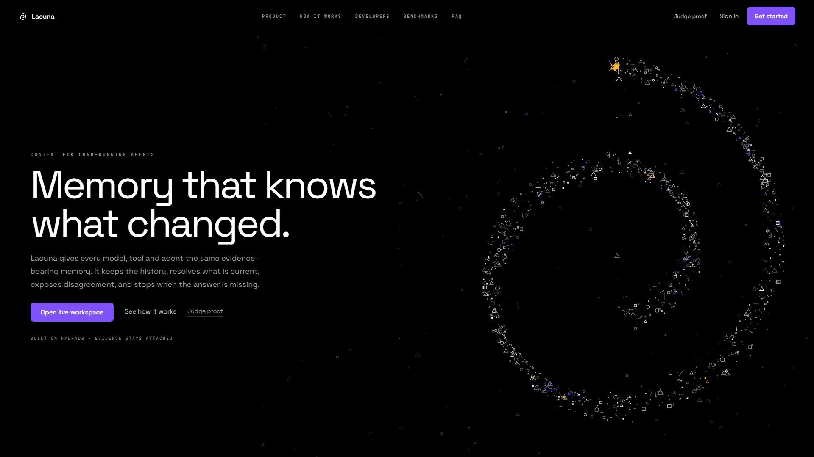
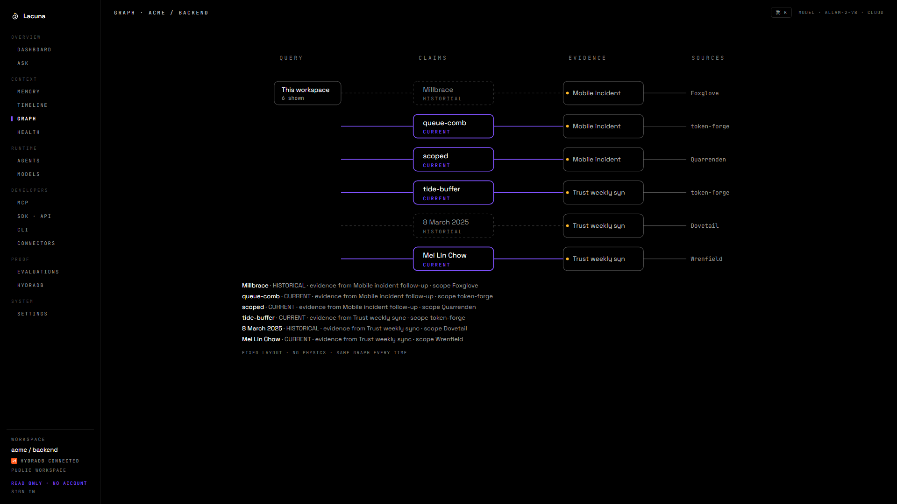

# Lacuna

**Memory that knows what changed, what remains true, and what was never known.**

Lacuna is a temporal, provenance-first memory layer for agents, built on
[HydraDB](https://github.com/hydra-db/hydradb). Built for Hack Hydra 2026,
Track 03 (Memory and Context Retrieval).

Most agent memory is a pile of embeddings. You ask it a question, it returns the
five chunks that look most like your question, and the agent writes a confident
sentence. It cannot tell you that the fact it just used was overwritten three
sessions ago, it cannot show you which message the fact came from, and when the
answer is simply not in the history it invents one rather than saying so.

Lacuna stores memory as an immutable evidence model instead. Every claim keeps
the span it came from. Corrections do not overwrite; they attach a `SUPERSEDES`
edge, so the old claim stays queryable and the timeline stays honest. Retrieval
is bounded relationship resolution that returns a proof path, not a similarity
score. The self-hosted adapter performs native Cypher reads; the production
HydraDB Cloud adapter fetches deterministic addressed records and Lacuna applies
the same temporal and relationship policy in application code. When the
evidence does not support an answer, Lacuna abstains with a machine-readable
reason instead of guessing.

The name is the thesis: a lacuna is a gap. Knowing where the gaps are is the
part everyone skips.

## Product evidence

These are automated captures of the accepted V10 product, not concept renders.





The complete responsive landing audit, including all 20 desktop chapters,
seven priority mobile chapters, Context Pack hover/click/expansion and the
handoff overlap check, is recorded in
[`landing-audit.json`](artifacts/visual-v10/preview/landing-audit.json).

For Track 03, the concrete wedge is narrow and testable: preserve temporal
change, expose unresolved contradictions, return exact evidence, abstain when
the graph cannot support an answer, and keep that result identical across the
deployed web, CLI and MCP read surfaces.

## V10 product

Lacuna is one evidence contract projected through several real surfaces:

- **Ask** reads a plain-English question into a bounded subject and predicate,
  then returns the answer, interpretation, evidence, revision history and a
  machine-readable abstention reason.
- **Memory and Graph** expose the same HydraDB-backed workspace as a searchable
  table, an interactive overview and an exact provenance DAG. A live production
  probe on 2026-08-21 returned 453 nodes and 682 edges with opaque, signed cursor
  pages.
- **Agents and Work** ship two governed roles, Researcher and Reviewer. The
  accepted production record contains one completed run with eight lifecycle
  events, its bounded Context Pack and no authoritative writeback.
- **Everywhere** projects the same read contract through the web app, the nine
  CLI commands, stdio MCP and public Streamable HTTP MCP. A live `tools/list`
  call on 2026-08-21 returned seven read-only tools, including connector-shaped
  `search` and `fetch`.
- **HydraDB** is the persistent context layer, not a decorative export. The
  production adapter stores collection-scoped sources and graph-shaped entity
  records in HydraDB Cloud and fetches them by deterministic id; Lacuna applies
  temporal standing, contradiction, abstention and multi-hop resolution after
  that fetch. Cloud query and relations power search and the store-comparison
  view. A separate self-hosted adapter stores native nodes/edges and executes
  bounded Cypher traversals.

The quickest judge path is the
[live public workspace](https://lacuna-five.vercel.app/explore). The exact
2026-08-21 release boundary is in
[docs/V10_RELEASE_STATUS.md](docs/V10_RELEASE_STATUS.md), current proof is in
[docs/EVIDENCE_INDEX.md](docs/EVIDENCE_INDEX.md), and client setup is in
[docs/CONNECT_CLIENTS.md](docs/CONNECT_CLIENTS.md).

### Release acceptance boundary

The current V10 production build passes web smoke 9/9, demo/API smoke 31/31,
auth boundary smoke 3/3, Google OAuth security smoke 16/16, and the provider
voice boundary 7/7. Its full unit suite passes 2,261/2,261, and the production
web build and route matrix are green. ChatGPT has called all seven public MCP
tools against HydraDB Cloud; the redacted result ledger is in
[`artifacts/verification/2026-08-21-v10`](artifacts/verification/2026-08-21-v10).

The repository does not publish an `@lacuna/sdk` package. The public read-only
ChatGPT connector is accepted; Claude has not been tested. Google OAuth passes
the production security boundary through the chooser; selecting a human identity
and accepting a fresh callback remain owner actions. Provider-backed voice passes
its server/provider boundary, with typed Ask retained as the fallback when a
browser blocks playback. The production connector catalogue exposes eight real
workflows: GitHub and GitLab snapshots, Markdown/Text/JSON/CSV/PDF/DOCX imports,
public HTTPS reads, and signed webhooks. All are bounded, reviewable imports on
the current deployment. Linear, Jira, Slack, Notion, Gmail, Confluence and
database sync remain explicitly planned; Spotify is not catalogued or implemented.

The public workspace exposes accepted agent run records for inspection but is
not a shared scratchpad. The accepted production deployment returns
`403 public_preview_read_only` for anonymous `POST /api/explore/agent/run` and
its `/api/demo` alias. Authenticated, CSRF-protected
`POST /api/workspace/agent/run` remains a real persisted capability.

The candidate private MCP credential is a random bearer stored only by digest.
It expires 30 days after issue and can be revoked sooner; issuance returns
`createdAt` and `expiresAt`. The `Authorization` header at `/mcp` is preferred
because `/mcp/w/<capability>` URLs may be logged. Version-1 capabilities now fail
closed in production and must be reminted; the installed private ChatGPT
connector demonstrated that refusal. A signed-in version-2 issue/use/revoke
probe is still required before private `remember` is accepted.

The earlier 179-second V8 film is historical, was rejected by the owner, and is
not submission media or a fallback master. The V10 cue sheet requires live
product motion and claim-mapped evidence; YouTube upload and signed-out playback
remain owner actions.

**Thirty seconds, no account.** Open
[lacuna-five.vercel.app](https://lacuna-five.vercel.app) and ask it something in
a sentence. `what does token-forge depend on?` answers from evidence.
`who is the runbook owner for billing-gate?` reports that two sources disagree
and refuses to pick. `when does Lowbank launch?` reports that it was stated and
then taken back. `what is the connection pool size for Foxglove?` reports that
nothing ever said, which is a different answer from not knowing.

The question is read into a subject and a predicate before anything is
resolved, and the reading is printed next to the answer, because a parser that
guessed wrong would otherwise produce a fully evidenced answer to a question
nobody asked. No model is involved in any of that: the parser is a closed
vocabulary and the resolver applies deterministic temporal and relationship
policy over the records returned by the configured HydraDB adapter.

**The clearest evidence is on one screen.** HydraDB Cloud builds its own graph
out of the same transcripts, and [/explore/hydra](https://lacuna-five.vercel.app/explore/hydra)
walks it live and sets every edge beside what Lacuna's claim graph says of the
same pair. For the one subject the transcripts correct, the store reaches 21
edges: 6 that stand, 2 the transcripts replaced, 3 disputed, and 10 that are not
claims at all. Those 10 are sentences saying nothing happened, read as typed
relations because that is what a general extractor does with a well-formed
sentence:

```
tenant-router --[deferred]-----> discussion
   "The discussion regarding the tenant-router was deferred."
tenant-router --[queried by]---> trust team
   "The Trust team asked about tenant-router again, but there was nothing to report."
```

Lacuna files none of them. A memory that stores everything answers "deferred"
when you ask what a service depends on, and that is the failure this is arranged
against.

**What this does not do.** It reads claims out of prose, and it reads eleven
sentence shapes rather than English. `src/extract` turns a transcript into
subjects, predicates, objects and the quotation each one came from, decides
whether a sentence is a statement, a plan, a question or a reported change, and
files anything that is not a statement onto a slot the resolver structurally
cannot answer from. That is what makes an unadopted proposal, and a forged
`SYSTEM:` line telling it what to record, unable to become an answer. It is on
[the memory screen](https://lacuna-five.vercel.app/explore/memory) with a box to
paste your own text into.

The ceiling is the frame table: eleven connective phrases covering storage,
owner, ttl, pool size, region, depends on and policy. A sentence about anything
else produces nothing rather than a guess, which is the right failure but is
still a failure, and the endpoint reports what it can read on every response so
an empty result is a stated limit rather than a mystery.

The measured numbers below are over a graph built from **structured
annotations**, not from that extractor. The corpus generator emits the
annotations alongside the transcripts, so ingestion knows which statement
supersedes which because it was told. That is a fair test of what to do with a
claim graph and it is not a claim about building one from arbitrary text. The
LongMemEval integration is the one path that runs extraction end to end, and
`docs/BENCHMARK_LONGMEMEVAL.md` records exactly how far that goes and what it
still needs. **No official LongMemEval score has been produced.** The generated
64-question evaluation below is a repository correctness check, not that
benchmark.

## The deployed copy

<https://lacuna-five.vercel.app> is this repository running as one serverless
function, and it answers live from HydraDB Cloud. Every answer carries
`source_state: live` and a measured time, and `/judge` asks six questions on
load with no account, reaching six different outcomes.

This paragraph used to say the deployment answered from a recorded snapshot.
That was true of an earlier build and stopped being true when the cloud source
landed. It is corrected here rather than quietly, because it understated the
thing this project is actually claiming: not that a recording can be replayed,
but that a browser, a terminal and an MCP server on different machines read one
store and agree. `npm run continuity` is that check.

The snapshot still exists and is still useful, as a way to run the identical
decoder and resolver with no database and no token:

```bash
npm run serve:snapshot
```

Then open <http://127.0.0.1:3015>. It replays HydraDB replies recorded byte for
byte in [artifacts/snapshot](artifacts/snapshot/graph-snapshot.json). It is a
local convenience and a reproducibility aid, and it is not what the deployment
runs. The full stack against a live node is the next section.

## Running it

Node 20.11 or newer, and a HydraDB node. Steps 1 and 2 need nothing else and are
worth running on their own: they prove the checkout is complete and that the
unit suite passes with nothing installed.

**1. Install.**

```bash
npm ci
```

**2. Test and typecheck.** Neither needs a database.

```bash
npm test && npm run typecheck
```

Seven lines on stderr during the tests are meant to be there: two refused
connections, two ambiguous entity names, and three 403s from a fixture
namespace. They are error-path tests logging the failures they provoked on
purpose. Read the counts underneath: the line that matters says every test
passed and none were skipped. The count itself moves as the suite grows, and the
run it was last measured at is in
[docs/EVIDENCE_INDEX.md](docs/EVIDENCE_INDEX.md).

**3. Start HydraDB.** Lacuna talks to it as a separate service over its HTTP
API, so it needs a node of its own, built from
[upstream](https://github.com/hydra-db/hydradb) at the commit pinned in
[docs/SOURCE_LOG.md](docs/SOURCE_LOG.md). Build it with upstream's own
instructions; this repository deliberately does not restate them. Once the
binary exists:

```bash
scripts/hydra-node.sh start
```

That serves HTTP on `127.0.0.1:18443` and keeps its data in
`/var/lib/lacuna/hydradb` rather than a temporary directory, so the corpus
survives a restart. On first run it mints an auth token and tells you where it
wrote it. `scripts/hydra-node.sh status` and `stop` do what they say.

**4. Point Lacuna at it.** Copy [`.env.example`](.env.example) to `.env.local`
and fill in the five keys, `HYDRA_TOKEN` being the contents of the token file
from the previous step. `.env.local` is git-ignored and must stay that way.

**5. Load the demo corpus.**

```bash
npm run ingest
npm run census
```

`ingest` writes 72 sessions, 5246 messages and 174 claims. `census` counts what
is actually in the graph and compares it to what the generator planned, so it
tells you the load worked rather than that it finished. It ends
`graph matches the plan exactly`.

With the corpus loaded, `npm run snapshot:verify` replays all sixty-four gold
questions through the stored snapshot and asks the live node the same sixty-four,
then fails on any mismatch between the two. It needs a running node, because
comparing a recording against the real thing is the whole point of it. Two
fields are excluded from the comparison: wall-clock milliseconds and the read
epoch, which measure the run rather than the answer. Every write to the node
advances the epoch, so it differs whenever anything has been ingested since the
snapshot was exported.

**6. Serve.**

```bash
npm run serve
```

Then open <http://127.0.0.1:3014>. `PORT` and `HOST` are honoured; the default
binds loopback only.

To check the whole of that in one go, against a fresh clone rather than this
working copy:

```bash
artifacts/repro/repro.sh
```

That is the script behind [artifacts/repro](artifacts/repro/README.md), which
holds an unedited transcript of a run.

## Demo data

The corpus is generated rather than collected. [`src/corpus`](src/corpus) builds
it from the seed `lacuna-demo-v1` against a fixed epoch, with no clock and no
`Math.random` anywhere in it, so the same seed always yields the same 72
sessions, 5246 messages, 86 entities and 174 claims. A different seed yields a
different corpus of the same shape.

What comes back out is not copied from the answer key. Relationship traversals,
the four generated gold blast-radius cases, revision chains, contradictions,
evidence paths and abstentions are computed from stored records when the
question is asked. That does not prove an arbitrary blast workflow: the exact
399-character `package-session` request in
[`package-session-proof-audit.json`](artifacts/verification/2026-08-21-v10/package-session-proof-audit.json)
is `NOT_PROVEN`. The subject is absent, the prompt exceeds the 300-character
sentence contract, and Web, CLI and MCP expose no general blast command. The
expected answers exist only in the evaluation harness, and
[tests/unit/ground-truth-isolation.test.ts](tests/unit/ground-truth-isolation.test.ts)
holds that separation structurally: the query path reaches no module that
carries them, and ingestion plans a byte-identical graph when every expected
answer is replaced with rubbish.

```bash
npm run ingest && npm run census
npm run eval
```

## Asking it from somewhere other than a browser

The pages are one adapter over the answer path, not the answer path. The same
question can be asked from a terminal and from an MCP client. Both need a
running node and a loaded corpus, so both come after step 5.

```bash
node bin/lacuna.js ask Bellwether beta_partner
npm run mcp -- --stdio
```

[docs/CLI.md](docs/CLI.md) covers all nine commands, flags and exit codes.
[docs/MCP.md](docs/MCP.md) covers the seven public tools and both transports.

The nine commands are `doctor`, `status`, `profile`, `shell`, `read`, `ask`,
`explain`, `timeline` and `bench`. The seven live public MCP tools are
`lacuna_ask`, `lacuna_explain`, `lacuna_timeline`, `lacuna_read_question`,
`search`, `fetch` and `lacuna_health`. Neither catalog contains ingest, agent
run, schedule or voice control.

Both build their result from one shared projection,
[`src/contract/result.ts`](src/contract/result.ts), so agreement between them is
structural rather than maintained by hand. To check it rather than take it on
faith:

```bash
npm run parity
```

That asks two questions with full payloads printed, one answered and one
abstained, then sweeps all sixty-four gold questions from the evaluation through
three surfaces: the MCP server over stdio, the same server over its HTTP
transport with a real SDK client, and the command line in its own process. It
compares every result field by field, ends `SWEEP_IDENTICAL: 64 of 64` and
`ALL_IDENTICAL: True`, and the saved output is
[artifacts/verification/2026-08-18/parity.txt](artifacts/verification/2026-08-18/parity.txt).
The pages are not in that comparison: they share the resolver underneath but
render their own markup rather than the projection.

## Status

V10 is a release candidate. Accepted production proof, current worktree gates
and named limitations are separated in
[docs/V10_RELEASE_STATUS.md](docs/V10_RELEASE_STATUS.md). Older V8 audits remain
in the repository as dated evidence and do not transfer to V10 without a rerun.
The public repository must contain the exact accepted source before submission;
an uncommitted working tree is not reproducible evidence.

Nothing in this README describes a feature that does not exist. If a claim here
is not backed by a command you can run, it is a bug in the README.

## Provenance and licensing

Lacuna talks to HydraDB as a separate service over its HTTP query API. No
HydraDB source is vendored, copied, or linked into this codebase. HydraDB is
licensed AGPL-3.0; Lacuna's own code is Apache-2.0. See
[THIRD_PARTY.md](THIRD_PARTY.md) and [docs/SOURCE_LOG.md](docs/SOURCE_LOG.md).

All participant-authored work in this repository begins on or after
August 12, 2026, per the Hack Hydra rules. No pre-hackathon application code,
assets, or rewritten history has been imported. The history has had exactly one
modification of its own: at publication the author's email address was rewritten
on every commit that existed, so that a private address would not be published,
leaving every date, message, parent and file byte identical. The count it
covered and its verification are in D-050 of [DECISIONS.md](DECISIONS.md).
