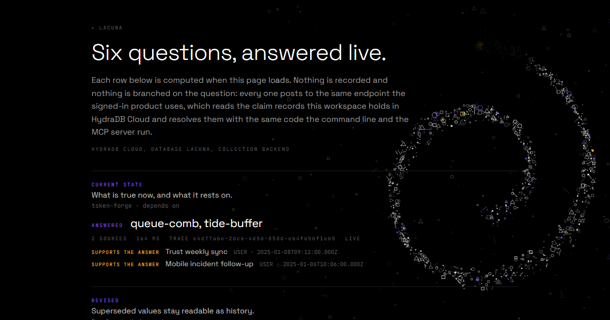
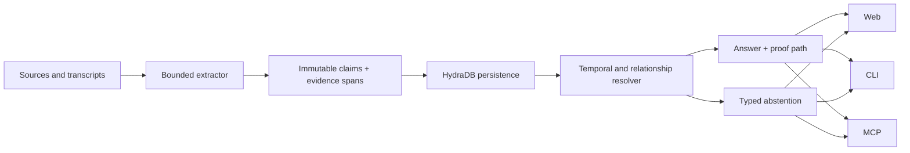

<p align="center">
  
</p>

<h1 align="center">Lacuna</h1>

<p align="center"><strong>Memory that knows what changed, what remains true, and what was never known.</strong></p>

<p align="center">
  <a href="https://lacuna-five.vercel.app/explore"><strong>Try the live workspace</strong></a>
  · <a href="#quickstart">Quickstart</a>
  · <a href="docs/EVIDENCE_INDEX.md">Evidence</a>
  · <a href="docs/MCP.md">MCP</a>
  · <a href="CONTRIBUTING.md">Contribute</a>
</p>



Lacuna is a temporal, provenance-first memory layer for AI agents, built on
[HydraDB](https://github.com/hydra-db/hydradb). It keeps every claim tied to the
sentence it came from, preserves corrections instead of silently overwriting
history, exposes unresolved conflicts, and abstains when the evidence cannot
support an answer.

It was built for **Hack Hydra 2026, Track 03: Memory and Context Retrieval**.
The project is open source under Apache-2.0.

## Try the failure cases first

The public workspace is read-only and requires no account:

| Ask | What Lacuna should show |
| --- | --- |
| `what does token-forge depend on?` | A current answer with exact evidence |
| `who is the runbook owner for billing-gate?` | Two conflicting sources and a refusal to choose silently |
| `when does Lowbank launch?` | A statement that was later withdrawn |
| `what is the connection pool size for Foxglove?` | That nobody ever stated it |

Open the [live workspace](https://lacuna-five.vercel.app/explore) or the
[six-outcome judge view](https://lacuna-five.vercel.app/judge).

## Why another memory layer?

Most agent memory stacks reduce history to nearby text chunks. That is useful
for recall, but similarity does not answer the questions that determine whether
a memory is safe to use:

- Is this claim still current?
- Was it replaced by a later statement?
- Do two sources disagree?
- Which exact sentence supports the answer?
- Was the fact never stated at all?

Lacuna stores an immutable evidence graph. Corrections create `SUPERSEDES`
relationships instead of deleting the old claim. Retrieval applies bounded
temporal and relationship policy, returns the proof path, and emits a typed
abstention when the graph cannot justify an answer.

## What ships

| Surface | Current role |
| --- | --- |
| **Web** | Ask, memory table, interactive graph, provenance paths, timelines and public judge flows |
| **CLI** | Nine commands over the same read contract; see [CLI.md](docs/CLI.md) |
| **MCP** | Seven verified public read-only tools over Streamable HTTP and local stdio; see [MCP.md](docs/MCP.md) |
| **HydraDB Cloud** | Production persistence, deterministic record reads, query and relation inspection |
| **Self-hosted HydraDB** | Native nodes, edges and bounded Cypher traversal |
| **Agents and Work** | Governed Researcher and Reviewer runs with bounded Context Packs and inspectable lifecycle evidence |

The fastest verified path is the
[public workspace](https://lacuna-five.vercel.app/explore). The precise release
boundary and all current caveats live in
[V10_RELEASE_STATUS.md](docs/V10_RELEASE_STATUS.md).

## Quickstart

### Reproduce the resolver without a database

This path uses the checked-in HydraDB response snapshot. It is the quickest way
to inspect the product and run the tests without a token or external service.

```bash
git clone https://github.com/vaibhav4046/lacuna.git
cd lacuna
npm ci
npm test
npm run typecheck
npm run serve:snapshot
```

Open <http://127.0.0.1:3015>.

### Run the full self-hosted stack

Requirements:

- Node.js 20.11 or newer
- a HydraDB node built from the upstream revision pinned in
  [SOURCE_LOG.md](docs/SOURCE_LOG.md)

```bash
cp .env.example .env.local
scripts/hydra-node.sh start
npm run ingest
npm run census
npm run serve
```

Open <http://127.0.0.1:3014>. Keep `.env.local` untracked and never commit a
HydraDB token. Full ingestion mechanics are documented in
[INGEST.md](docs/INGEST.md).

## MCP

The public production endpoint is:

```text
https://lacuna-five.vercel.app/mcp
```

A local client can spawn the stdio server:

```json
{
  "mcpServers": {
    "lacuna": {
      "command": "npm",
      "args": ["run", "mcp", "--", "--stdio"],
      "cwd": "/absolute/path/to/lacuna"
    }
  }
}
```

Exact ChatGPT, Claude, Claude Code, REST and CLI instructions are in
[CONNECT_CLIENTS.md](docs/CONNECT_CLIENTS.md). Named-client instructions are not
claims that every client has completed an external verification run; the
release-status document records what has actually been proven.

## Architecture



The production Cloud adapter and the self-hosted graph adapter do real but
different work. The Cloud answer path fetches deterministic records and applies
Lacuna's temporal policy in application code. The self-hosted adapter executes
bounded Cypher over native nodes and edges. They are deliberately documented as
separate evidence boundaries.

Read the complete architecture in
[ARCHITECTURE_FINAL.md](docs/ARCHITECTURE_FINAL.md) and its invariants in
[ARCHITECTURE_INVARIANTS.md](docs/ARCHITECTURE_INVARIANTS.md).

## Evidence, not benchmark theatre

Start with these documents:

- [Evidence index](docs/EVIDENCE_INDEX.md): dated proof artifacts and commands
- [V10 release status](docs/V10_RELEASE_STATUS.md): what the current production build proves and what remains open
- [LongMemEval boundary](docs/BENCHMARK_LONGMEMEVAL.md): official dataset adapter scope without inventing an official score
- [Benchmarks](docs/BENCHMARKS.md): measured repository checks and their limitations
- [Reproduction record](artifacts/repro/README.md): fresh-clone execution evidence

The generated 64-question evaluation is a deterministic repository correctness
check. It is **not** an official LongMemEval score. Lacuna currently has no
official LongMemEval answer/judge score.

## Honest limits

- The production extractor reads a bounded set of sentence frames, not arbitrary English.
- A sentence outside those frames produces no claim rather than a guess.
- The public preview is read-only; authenticated workspace writes have separate auth and CSRF boundaries.
- The Cloud and self-hosted HydraDB adapters must not be described as the same execution path.
- The exact current test status, including the worker-thread parser isolation flake observed on some serial runs, is recorded in [V10_RELEASE_STATUS.md](docs/V10_RELEASE_STATUS.md).

## Contributing

Useful contributions are welcome, especially:

- high-precision extraction fixtures that preserve abstention;
- reproducible failure cases and regression tests;
- clearer installation, MCP and connector documentation;
- accessibility and responsive-product fixes;
- benchmark adapters that keep ground truth isolated.

Read [CONTRIBUTING.md](CONTRIBUTING.md), choose an item from the
[public roadmap](docs/ROADMAP.md), or open a scoped issue. Claims in code,
documentation and launch material must point to reproducible evidence.

## Security

Do not publish credentials, private workspace data or working exploits in an
issue. Follow [SECURITY.md](SECURITY.md) for private reporting and supported
versions.

## License

Apache-2.0. See [LICENSE](LICENSE) and [NOTICE](NOTICE).

Built by [Vaibhav Lalwani](https://github.com/vaibhav4046).

If Lacuna solves a real problem for you, starring the repository helps other
agent builders find it. A failure case, issue or contribution is even more
useful.
